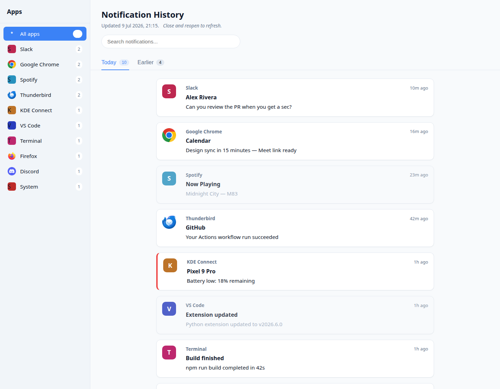
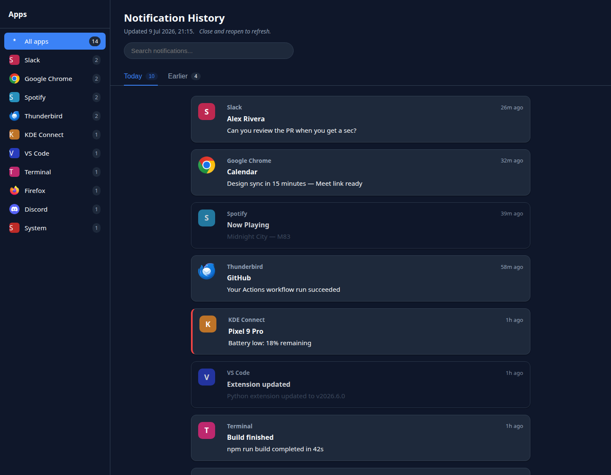
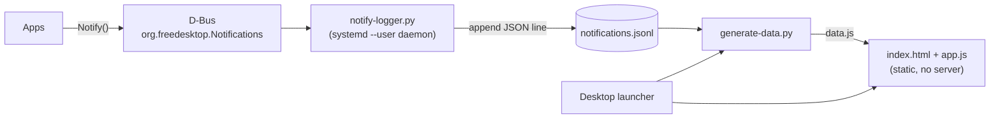

<div align="center">

# 🔔 Notistory

### Never miss a Linux desktop notification again.

Notifications on Linux vanish in seconds. **Notistory** silently records every one of them and
gives you a clean, searchable, browsable history — sorted newest-first, split into **Today** and
**Earlier**, and filterable **per application**. Like your phone's notification log, but for your
Linux desktop.

[](https://sirpurnikhil.github.io/notistory/)
[](LICENSE)


**▶ Try the [live demo](https://sirpurnikhil.github.io/notistory/)** (synthetic sample data — the real app runs locally on Linux).

<br>



</div>

---

## Why

You're heads-down, a notification slides in and out in three seconds, and it's gone. Was it
important? Who sent it? Linux — unlike Android or iOS — has no universal, browsable notification
history. KDE keeps a shallow, ephemeral list; most desktops keep nothing at all.

Notistory fixes that with a tiny background recorder and a modern web UI, entirely local and
private. No accounts, no network, no telemetry.

## Features

- **📥 Captures everything** — a passive D-Bus monitor records every notification the moment it
  fires (app, title, body, urgency, icon, timestamp). Negligible CPU, no polling.
- **🕑 Time-sorted history** — newest first, grouped into **Today** and **Earlier**, with day
  headers (Yesterday, dates) in the Earlier view.
- **🗂️ Per-app filtering** — a sidebar lists every app with its icon and count; click to see only
  that app's notifications.
- **🔎 Instant search** — live full-text filtering across title, body, and app name.
- **🎨 Modern, minimal UI** — clean cards, urgency accents (critical = red bar, low = muted),
  automatic **light / dark** theme following your system.
- **🏷️ Smart app names** — resolves real app names and icons; normalizes messy IDs
  (`com.spotify.Client` → *Spotify*) with a user-editable override map.
- **🔒 100% local & private** — data lives in a plain-text file on your machine. Nothing leaves it.
- **🖱️ One-click launch** — a desktop + app-menu entry ("Notistory") opens the history in your
  browser. No server, no open ports.

<div align="center">

<br><em>Automatic dark theme.</em>
</div>

## How it works



1. **Capture** — a `systemd --user` service uses D-Bus `BecomeMonitor` to observe every `Notify`
   call on the session bus and appends it to an append-only JSONL log. It starts on login and
   restarts on failure.
2. **Store** — one JSON object per line at `~/.local/share/notistory/notifications.jsonl`.
   Human-readable, greppable, trivially portable.
3. **View** — clicking the launcher regenerates a `data.js` snapshot (resolving app icons and
   normalizing names) and opens a fully static HTML page via `file://`. No web server, no port,
   no framework.

> **Design note:** the UI loads its data through `<script src="data.js">` rather than `fetch()`,
> specifically so it works from `file://` without a server (browsers block `fetch()` of local
> files under CORS, but not script tags). This keeps the whole thing dependency-free and portable.

## Tech stack

| Layer     | Choice                                             |
|-----------|----------------------------------------------------|
| Capture   | Python 3 · `dbus-python` · GLib main loop          |
| Storage   | Append-only JSONL (flat file)                      |
| UI        | Vanilla HTML / CSS / JS — no framework, no build   |
| Packaging | `systemd --user` service + freedesktop `.desktop`  |

## Quick start

> **Requirements:** Linux with a freedesktop notification server (KDE Plasma, GNOME, XFCE, etc.),
> `python3`, `python3-dbus`, and `python3-gi`. On Debian/Ubuntu:
> `sudo apt install python3-dbus python3-gi`.

```bash
git clone https://github.com/sirpurnikhil/notistory.git
cd notistory
./install.sh
```

That's it. The recorder starts immediately and on every login, and a **Notistory** icon appears on
your Desktop and in your app menu. From now on, every notification is recorded.

To uninstall (recorded history is preserved):

```bash
./install.sh --uninstall
```

## Usage

- Open **Notistory** from the Desktop / app menu (or run `bin/open-notistory.sh`).
- Filter by app in the sidebar · search in the top bar · switch **Today** / **Earlier** tabs.
- The page is a snapshot taken when you open it — close and reopen to refresh.

> Notistory records notifications from the moment it's installed; it can't recover ones that fired
> before it was running.

## Configuration

Rename apps that report ugly or generic names by editing
`~/.config/notistory/app-names.json` (created on first run):

```json
{
  "org.kde.dolphin": "Files",
  "notify-send": "My Scripts"
}
```

Keys match either the raw app name or its `desktop-entry` id (case-insensitive). Reopen to apply.

## Data & privacy

- All data stays on your machine in `~/.local/share/notistory/notifications.jsonl`.
- No network calls, no telemetry, no accounts.
- Clear history anytime: stop the service, delete/trim the JSONL file, start it again —
  `systemctl --user stop notistory && : > ~/.local/share/notistory/notifications.jsonl && systemctl --user start notistory`.

## Project structure

```
src/notify-logger.py     D-Bus monitor daemon → JSONL
src/generate-data.py     JSONL → data.js (icon resolution + name normalization)
src/index.html           UI shell
src/app.js               UI logic (tabs, per-app filter, search, sort, avatars)
src/style.css            theming (light + dark)
bin/open-notistory.sh    regenerate snapshot + open the UI
systemd/notistory.service  user-service template
install.sh               path-agnostic installer / uninstaller
demo/                    synthetic sample data + demo builder
docs/                    self-contained live demo (GitHub Pages)
```

## Roadmap

- [ ] Optional persistent local server for live auto-refresh
- [ ] "Do not record" per-app rules
- [ ] Export / archive rotation for very long histories
- [ ] Packaging (AUR / `.deb`)

## License

[MIT](LICENSE) © 2026 Nikhil Sirpur

<div align="center"><sub>Built for the Linux desktop. Your notifications, on your machine, under your control.</sub></div>
